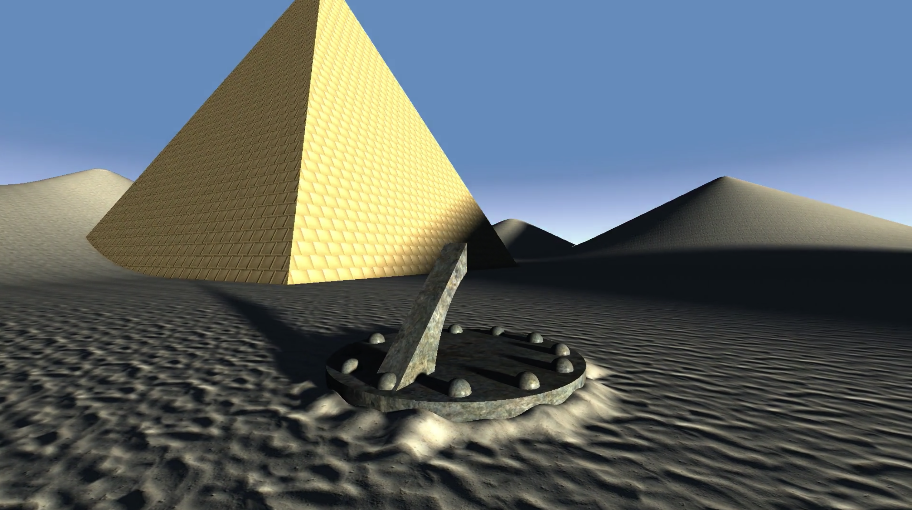

# Distance Fields: Rendering Worlds with two Triangles

This is a small demo of a sundial in a desert, intended to be run in [Shadertoy](https://www.shadertoy.com). 

Team Members: Ben Darnell, Liam Foster, Seif Ibrahim

Slideshow presentation: [https://docs.google.com/presentation/d/1SLXjlABk-iLjBLwCy6RVyCMza07wXS8ex4jgQIrr5Fs](https://docs.google.com/presentation/d/1SLXjlABk-iLjBLwCy6RVyCMza07wXS8ex4jgQIrr5Fs)

## Building and Running

1. Clone or download the source code: `git clone https://github.com/AlphaModder/raymarched-sundial.git`
2. Run the preprocessor in the top-level source directory to create a single file for ShaderToy: `python make.py cat`
3. Create a new ShaderToy project by visiting [Shadertoy](https://www.shadertoy.com/new)
4. Copy the contents of the generated main.glsl file into ShaderToy’s code editor
5. Copy the contents of scripts/bookmarklet.js and make a bookmark with those contents as the link. Put it in your bookmarks toolbar so you can click it.
6. In your ShaderToy tab click your new bookmark and you should see 4 textures load into ShaderToy’s 4 channels below the code editor. (Note that instead of creating a bookmark you can directly copy the contents of scripts/bookmarklet.js into your URL bar. However this does not work on all browsers as they might be blocking JavaScript execution in the URL bar.)
7. Click the run button at the bottom of ShaderToy’s code editor to run the demo.

In order to make edits, copy the shadertoy script into main.glsl and run `python3 make.py uncat` to save changes.

## Project Description

We use signed distance fields (SDFs) to render a scene using only a flat rectangular canvas. This means the GPU is passed a fixed vertex buffer corresponding to two triangles that fill the screen, and all rendering occurs in the fragment shader. Rather than triangles, our scene geometry is represented by composition of *signed distance functions*. The signed distance function of an object is the function that, given a point in space, returns the distance between that point and the nearest point on the surface of the object. If the point lies within the object, this distance is negative, otherwise it is positive. By transforming basic SDFs and combining them via the Constructive Solid Geometry operations (union, intersection, difference), we were able to construct a complex scene from primitive shapes such as spheres, cylinders, cones, pyramids, planes, and so on.

We shade our scene using a technique known as raymarching. Raymarching is similar to ray tracing in that it involves casting rays from the camera and shading the pixel at the intersection of the ray and the canvas based on the object the ray hits in the scene. Unlike raytracing, raymarching is an iterative algorithm that takes advantage of SDFs. First, we check the point in the scene nearest to the current point on the ray. If this distance is greater than zero, we step exactly that distance further along the ray, which allows us to take large steps when possible without ever missing an object intersection, an optimization critical to the algorithm’s efficiency. If the distance is less than or equal to zero, we record a hit. This process is repeated until we hit something, or a maximum distance or number of iterations is reached.

Once a hit is recorded, we use information about its position and the object that was hit to begin shading. We also calculate a surface normal by approximating the SDF’s gradient at the hit point via central differences. From here, several things happen:

- We calculate the object material’s properties at the given point, including its color, specular exponent, and specular intensity. For more detailed surfaces, such as the sand and the pyramid bricks, we adjust the surface normal based on a normal map either provided by a texture and decoded by our code (in the case of the sand) or procedurally generated (in the case of the bricks).
- In order to produce soft shadows, we raymarch from the hit point to each light source, using the closest distance the ray attains to an object to obtain a shadow factor, which attenuates the light source’s intensity.
- We apply an approximation to create believable ambient lighting without global illumination. By checking the SDF at randomly-sampled points in the hemisphere around the surface normal, we calculate an ambient occlusion factor based on the distance to nearby geometry and use it to attenuate ambient intensity.

Once all these calculations have been completed, we can apply the Blinn-Phong lighting model at the hit point to obtain the final amount of light reflected into the camera, and shade the pixel corresponding to our initial ray accordingly.

This technique makes use of SDFs allowing it to take large steps along the ray as it traces towards the scene — this gives it performance advantage over constant step-size raytracing. Raymarching works by iteratively finding the closest point in the scene to a point on the ray starting from the point at the camera. We repeatedly do this until we end up with a point on the ray that is close enough (within a small threshold) to an object in the scene. The result of this ray operation gives us the hit point in the scene along with the properties of the object that was hit. Using this information we can shade the pixel in the canvas corresponding to the ray. In order to do this we need lighting information as well as texture information for that point. In order to determine whether a hitpoint is in shadow we raymarch from that point to a light source. If there is an object between the point and the light source (i.e. if the distance to an object is less than the distance to a light source) we consider the hit point to be in shadow and give it a shadow factor based on its proximity to the intervening object. The Blinn-Phong reflection model is used to calculate a amount of light at the hitpoint, with the shadow factor affecting the amount of specular and diffuse lighting at that point. In calculating the specular and diffuse lighting for the Blinn-Phong model we require surface normals. These normals are partially obtained from taking the gradient of the SDF. In addition to this, there are more detailed surfaces, such as the sand and the pyramid bricks, that require additional normals which are either provided as a texture and decoded by our code (in the case of the sand) or procedurally generated (in the case of the bricks). Finally, as a way of approximating ambient light without doing global illumination we use a technique called ambient occlusion. It works by sampling points around the hitpoint (along the normal) and comparing their distance to the hitpoint with their distance to the closest point in the scene. Based on the surroundings of the hitpoint (e.g. whether it’s in the open or in some crevice) it will get more or less ambient light.

Our ShaderToy demo features a sundial in a sand desert. We use a rising and falling sun as our light source. It has the effect of showing our sundial in action as well as showing the scene during daytime and nighttime.

We include a number of visual effects to enhance the scene such as a gradually transitioning sky color as the sun sets. To generate seamless sand dunes use a smooth union operation that combines several rounded cones. We use triplanar texture mapping (mapping 3 times from the x, y and z planes) so that our textures do not stretch or warp when we map them onto our surfaces. Finally, as the GPU does not deal with texture derivatives properly when using this SDF method, artifacts can appear at the edges of objects where there is a big jump in UV space. To mitigate this we cast rays in a 2x2 pixel area to approximate the derivatives ourselves.

In order to facilitate group collaboration, we created a script `make.py` that organizes the shader into separate glsl files that can be re-assembled on the fly. Additionally, we used a javascript bookmarklet to use custom textures with shadertoy. The code is broken down in the following files:
 
- `material.glsl:` This file contains the struct for materials with custom blinn-phong parameters.
- `math.glsl:` All stand-alone mathematical functions and operations used in the project.
- `render.glsl:` This is the main file of the project. `mainImage` takes in the screen pixel, and outputs the shaded fragment. It generates a ray struct that is marched through the scene. Ambient occlusion, direct lighting, and shading are all calculated.
- `scene.glsl:` Defines the set of objects that make up the scene, including the desert, sundial, and pyramid. These objects are unioned together to create the scene.
- `sdf.glsl:` Contains signed distance functions for all objects in the scene. Basic geometries include a plane, sphere, cylinder, cube, pyramid, and cone. Additionally, utilities including `sdfUnion`, `sdfIntersection`, `sdfDifference`, and `sdfSmoothUnion` are used for compositing basic geometries.
- `texture.glsl:` Resources for procedural textures. The textures from `brickTexture` and `brickNormal` are generated and sampled using bi-planar sampling along the x-z plane.

## Division of Work

Ben Darnell:
- Added procedural texture generation and sampling
- Initial work on the dynamic sky and camera
- Wrote python tooling for grouping and splitting files
- Designed background scene geometry

Liam Foster:
- Implemented the raymarching framework used by the shader
- Wrote a lighting model including Phong shading, ambient occlusion and soft shadows
- Designed the foreground scene geometry
- Developed lookup-based horizon glow for dynamic sky

Seif Ibrahim:
- Wrote slideshow presentation and script
- Created and edited the presentation video
- Drafted documentation for the project
- Did initial work to make the desert sand dunes
- Wrote a JavaScript bookmarklet for easy loading of textures into ShaderToy

## Citations

[raymarching distance fields](https://www.iquilezles.org/www/articles/raymarchingdf/raymarchingdf.htm)  
[distance functions](https://www.iquilezles.org/www/articles/distfunctions/distfunctions.htm)  
[penumbra shadows in raymarched SDFs](https://www.iquilezles.org/www/articles/rmshadows/rmshadows.htm)  
[Hemispherical Signed Distance Field Ambient Occlusion](http://www.aduprat.com/portfolio/?page=articles/hemisphericalSDFAO)  
[Rendering Worlds in Two Triangles](http://iquilezles.org/www/material/nvscene2008/rwwtt.pdf)
